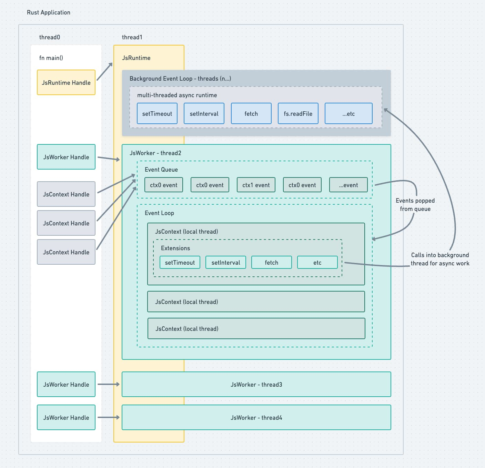

# Ion.js ⚡

## A JavaScript Runtime for Rust

Ion is a JavaScript runtime for integrating a JavaScript engine within a Rust program. This is useful for cases like building out a JavaScript powered plug-in system - but it can also be used directly from a stand alone executable.

Goals:
- ✅ Easy to use high-level API (Inspired by napi-rs)
- ✅ Event-loop built on top of Tokio
- ✅ Simple API to add a standard library
- ✅ Positively multi-threaded
- 👀 C FFI for embedders coming from other languages


## CLI Usage

The repo includes a reference executable that implements Ion, you can find it under [./crates/ion_cli](./crates/ion_cli)

```bash
cargo build --release
./target/release/ion_cli eval "console.log('42')"
```

## Embedder Usage

```bash
cargo add --git https://github.com/alshdavid/ion.git ion
```

### Basic

For more, see [./examples](./examples)

```rust
use ion::*;

pub fn main() -> anyhow::Result<()> {
    let runtime = JsRuntime::initialize_once()?;

    // Create an isolate running on a dedicated thread
    let worker = runtime.spawn_worker()?;

    // Open a JavaScript context (a fresh globalThis) to execute JavaScript.
    // You can open multiple contexts, sharing the same thread
    let ctx = worker.create_context()?;

    // Execute some JavaScript in the context
    ctx.exec_blocking(|env| {
        // Evaluate arbitrary JavaScript, the result of the last line is returned
        let value = env.eval_script::<JsNumber>("1 + 1")?;

        // Cast to Rust type
        let result = value.get_u32()?;

        // Prints "2"
        println!("Returned: {}", result);
        Ok(())
    })?;

    Ok(())
}

```

### Calling JavaScript from Rust

```rust
use ion::*;

pub fn main() -> anyhow::Result<()> {
    let runtime = JsRuntime::initialize_once()?;

    let worker = runtime.spawn_worker()?;
    let ctx = worker.create_context()?;

    // Create a function on the global scope
    ctx.eval_script("globalThis.add = (a, b) => a + b")

    // Create a thread safe handle to the JavaScript function
    let add_handle = ctx.exec_blocking(|env| {
        let global_this = env.global_this()?;
        let function = global_this.get_named_property_unchecked::<JsFunction>("foo")?;
        ThreadSafeFunction::new(&function)
    })?;

    // Call JavaScript function
    let ret: u32 = tsfn.call_blocking(
        // Map Rust values to be used as JavaScript values
        |env| Ok((1, 1)), 
        // Map the return type to be used in Rust
        |env, ret| ret.cast::<JsNumber>()?.get_u32(),
    )?;

    println!("JavaScript function returned: {}", ret); // "3"
    Ok(())
}
```

### Calling Rust from JavaScript

```rust
use ion::*;

pub fn main() -> anyhow::Result<()> {
    let runtime = JsRuntime::initialize_once()?;

    runtime.register_extension(ion::extension::console())?;

    let worker = runtime.spawn_worker()?;
    let ctx = worker.create_context()?;

    // Create an "add" function that does the operation in Rust
    ctx.exec_blocking(|env| {
        let add = JsFunction::new(env, |env, ctx| {
            let a = ctx.args::<JsNumber>(0)?.get_u32()?;
            let b = ctx.args::<JsNumber>(1)?.get_u32()?;

            // Create a "oneshot" channel style promise
            let (promise, deferred) = JsDeferred::new(env);

            // Non blocking work running on a background thread
            std::thread::spawn(move || {
                let result = a + b;
                deferred.resolve(move |_env| Ok(result)).unwrap()
            });

            // Return Promise back to JavaScript
            Ok(promise)
        })?;

        let mut global_this = env.global_this()?;
        global_this.set_named_property("add", add)?;
        Ok(())
    });

    // Call the add function
    ctx.eval_script("globalThis.add(1, 1).then(console.log)")?; // "2"

    Ok(())
}
```

## Compatibility

The Ion extensions will focus on compatibility with Web standards first. Nodejs compat may come later

| API | Supported  | Notes |
|-|-|-|
| JSON | ✅ | |
| setTimeout | ✅ | |
| clearTimeout | ✅ | |
| setInterval | ✅ | |
| clearInterval | ✅ | |
| console | ✅ | Basic partial implementation |
| fetch | ✖️ | |
| Response | ✖️ | |
| Request | ✖️ | |
| Headers | ✖️ | |
| AbortController | ✖️ | |
| AbortSignal | ✖️ | |
| URL | ✖️ | |
| URLSearchParams | ✖️ | |
| Worker | ✖️ | |
| self.postMessage | ✖️ | |
| structuredClone | ✖️ | |
| MessagePort | ✖️ | |
| MessageChannel | ✖️ | |
| BroadcastChannel | ✖️ | |
| ReadableStream | ✖️ | |
| WritableStream | ✖️ | |
| TransformStream | ✖️ | |
| Blob | ✖️ | |
| WebSocket | ✖️ | |
| atob | ✖️ | |
| btoa | ✖️ | |
| TextEncoder | ✖️ | |
| TextDecoder | ✖️ | |
| crypto | ✖️ | |
| SubtleCrypto | ✖️ | |
| CryptoKey | ✖️ | |
| performance | ✖️ | |
| reportError | ✖️ | |
| queueMicrotask | ✖️ | |
| EventTarget | ✖️ | |
| Event | ✖️ | |
| ErrorEvent | ✖️ | |
| CloseEvent | ✖️ | |
| MessageEvent | ✖️ | |


## What Is Ion?

Ion is a JavaScript runtime targeting use cases where Rust applications need to embed a JavaScript runtime within them.

## Examples of this are:

- Plugin systems that call into JavaScript to do work
- SSR services that need to evaluate JavaScript to render outputs
- FaaS (Functions as a Service, think Lambda) servers

## Why not Node.js, Deno, or Bun?

**Node.js** is quite difficult to embed and brings along with it a lot of baggage. You may not need the built-in test runner or the built-in “standalone“ executable compiler.

Node.js can be embedded using libnode (+ Rust wrapper) however it can't be compiled to a static library and must be consumed as an external dynamically linked library (libnode.dylib libnode.so libnode.dll). This makes distribution a bit cumbersome.

Lastly, Node.js does not yet expose a C FFI (PR in progress), which means we must rely on a fork that adds that in, and they don’t distribute prebuilt binaries so we need to build libnode releases ourselves.

**Deno** is written in Rust and is a good candidate for embedding on paper. They distribute the deno_core crate, which is reasonably minimal; however, their user-land API is very difficult to work with.

To gain access to the Deno (and Node.js compat) standard library used by Deno requires forking deno_cli as they have largely coupled these additions to the main executable.

This makes sense for Deno’s use case as their primary focus is the CLI distributable, however it makes for a poor experience if a Rust-based project intends to reuse their work.

**Bun…** bun is completely un-embeddable so that’s a non-starter.

## How does Ion address these limitations? 

Ion takes a layered & compositional approach to building a runtime. The first brick is a solid core runtime that contains everything a growing project needs needed to build a complete runtime.

These are things like:

- JavaScript engine - v8
- Event loop - Tokio
- Support for ES modules
- Support for Worker threads
- etc

The second brick is a well-defined and ergonomic "user-land" API for consumers to extend the core runtime such that it can be leveraged to build a rich/fully featured runtime.

**Resolvers:** offer a simple user-land interface (basically impl Fn(String) -> PathBuf) that is called whenever JavaScript calls import. Ion includes a relative-path resolution algorithm by default, but the resolvers API can be used to add support for any desired resolution algorithm.

For example, you can use the OXC or Atlaspack resolver to add support for the Node.js resolution algorithm with almost 0 effort - something that is not possible/practical with Deno.

**Extensions:** have a similarly simple user-land interface that allows for the creation of importable JavaScript modules/globals that hook into native calls to facilitate writing the standard library 

For example, setTimeout, fs, fetch, etc

**Preprocessors:** also with a simple impl Fn(PreprocessorContext) -> PreprocessorResult interface allows consumers to take source files and convert them to JavaScript prior to execution.

For example, this can be used to add support for evaluating TypeScript

## Technical Details

Ion is written in Rust and uses v8 as the JavaScript backend and Tokio for the event loop.

### JsRuntime

A JsRuntime is a handle to an initialized JavaScript engine.

### JsWorker 

Spawned by a JsRuntime, a JsWorker is a handle to an initialized JavaScript environment running on its own thread.

### JsContext

Spawned by a JsWorker, a JsContext is a handle to an isolated globalThis with its own event-loop, used to evaluate JavaScript.

One JsRuntime can have multiple JsWorker threads. One JsWorker can have multiple JsContexts. Each JsContext has its own event-loop, shared with other JsContexts running within the same JsWorker.

JsRuntime, JsWorker and JsContext are pinned to their own dedicated threads. Their handles can be safely sent between threads.

This allows the JavaScript engine to maintain dedicated stable threads to evaluate JavaScript on, while the handles to those threads can be used anywhere.

This allows your core application to be multi-threaded and call into JavaScript from any thread without worrying about corrupting the underlying JavaScript engine. For instance;

A multi-threaded http server that calls into JavaScript to handle requests (lambda).

A multi-threaded bundler that calls into JavaScript to support plugins (Atlaspack)

## Architecture


